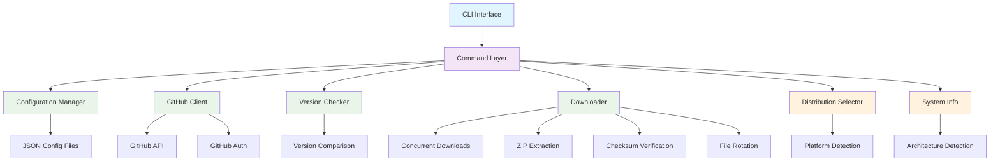
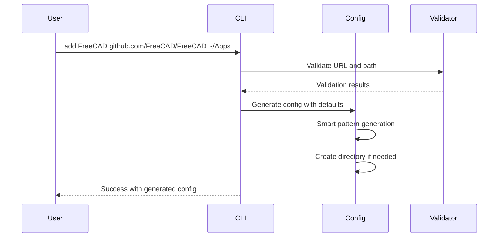
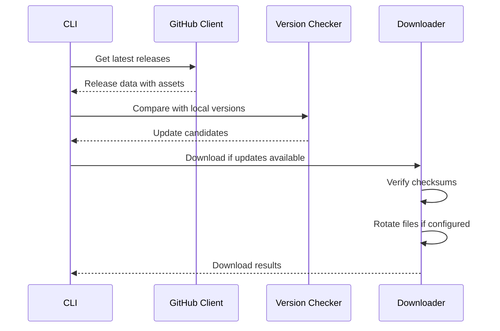
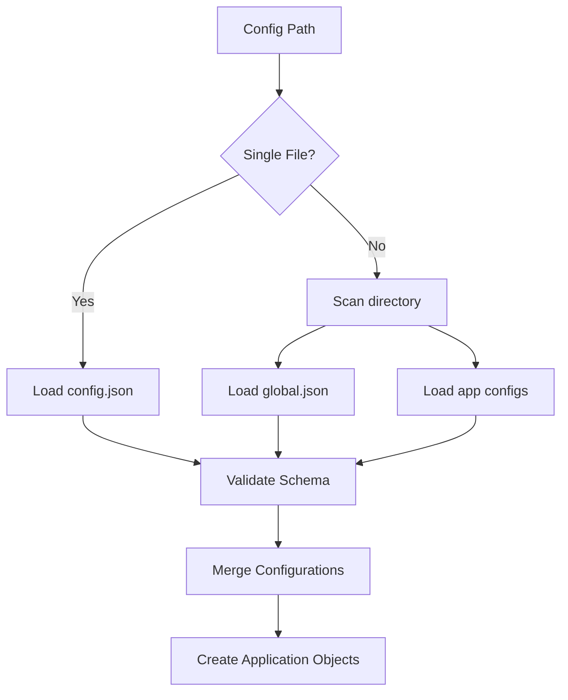

# Architecture

This document describes the architecture and design principles of AppImage Updater.

## High-Level Architecture



## Core Components

### CLI Interface (`main.py`)

The entry point for all user interactions, built with [Typer](https://typer.tiangolo.com/).

**Responsibilities:**

- Parse command-line arguments and options
- Coordinate between different components
- Handle global error handling and logging
- Orchestrate CLI command execution

**Key Features:**

- Rich console output with colors and progress bars
- Async command execution
- Structured error handling with clean user messages
- **Modular architecture** with extracted functionality:
  - `display.py` - Console output formatting and display functions
  - `pattern_generator.py` - GitHub URL parsing and intelligent pattern generation
  - `config_operations.py` - Configuration management and persistence operations
  - `distribution_selector.py` - Intelligent asset selection for multi-platform releases
  - `system_info.py` - System detection for compatibility filtering
  - `github_auth.py` - GitHub authentication management

#### Supporting Modules

**Display Module (`display.py`)**

- Console output formatting and styling
- Table generation and data presentation
- Progress indicators and status messages
- Rich console integration for enhanced UX
- Application listing and details display
- Check and download results formatting

**Pattern Generation (`pattern_generator.py`)**

- GitHub repository URL parsing and validation
- Intelligent AppImage pattern generation from actual releases
- Async GitHub API integration for pattern discovery
- Fallback pattern generation strategies
- Source type detection and URL normalization

**Configuration Operations (`config_operations.py`)**

- Application configuration loading and saving
- Configuration file and directory management
- Application addition, removal, and editing operations
- Configuration validation and error handling
- Default configuration generation
- Directory creation and validation

**Distribution Selector (`distribution_selector.py`)**

- Distribution-aware asset selection for multi-platform releases
- Automatic compatibility detection based on system information
- Interactive selection when automatic detection isn't possible
- Support for Ubuntu, Fedora, Arch, openSUSE, and other distributions
- Version compatibility scoring and selection

**System Information (`system_info.py`)**

- Comprehensive system detection (architecture, platform, distribution)
- Architecture compatibility checking (x86_64, arm64, i686, etc.)
- Platform detection (Linux, macOS, Windows)
- Supported format detection (.AppImage, .deb, .rpm, etc.)
- Distribution family identification for compatibility

**GitHub Authentication (`github_auth.py`)**

- GitHub token discovery from multiple sources
- Environment variable and config file token support
- GitHub CLI integration for token discovery
- Security-first priority ordering for token sources
- Authentication validation and error handling

### Configuration System

#### Configuration Models (`config.py`)

Pydantic-based models providing type-safe configuration validation.

**Models:**

- `GlobalConfig` - Global settings (timeouts, concurrency, logging)
- `ChecksumConfig` - Checksum verification settings
- `FrequencyConfig` - Update frequency configuration
- `ApplicationConfig` - Per-application settings

#### Configuration Loader (`config_loader.py`)

Handles loading and validation of configuration files.

**Features:**

- Single file and directory-based configuration
- Hierarchical configuration merging
- Path expansion and validation
- Error reporting with context

### Data Models (`models.py`)

Core data structures used throughout the application.

**Key Models:**

- `Release` - GitHub release information
- `Asset` - Download asset with checksum association
- `UpdateCandidate` - Available update with metadata
- `CheckResult` - Update check results
- `DownloadResult` - Download operation results
- `ChecksumResult` - Checksum verification results

### GitHub Integration (`github_client.py`)

Async HTTP client for GitHub API interactions with comprehensive release and asset management.

**Features:**

- Rate limiting awareness and respect
- Automatic checksum file detection and association
- Asset filtering and pattern matching
- Error handling with exponential backoff retries
- Authentication integration with `github_auth.py`
- Release caching and efficient API usage

**Key Methods:**

- `get_releases()` - Fetch repository releases (latest or all)
- `find_checksum_assets()` - Locate and parse checksum files
- `associate_assets_with_checksums()` - Link download assets to checksums
- `filter_assets_by_pattern()` - Pattern-based asset filtering
- `get_release_by_tag()` - Fetch specific release by tag

### Version Management (`version_checker.py`)

Handles version detection and comparison logic with intelligent fallback strategies.

**Components:**

- **Version Metadata System**: Reads version from `.info` metadata files for accurate tracking
- **Fallback Version Extraction**: Regex-based filename parsing when metadata unavailable
- **Semantic Version Parsing**: Uses `packaging.version` for proper version comparison
- **Multi-Format Support**: Works with `.zip`, `.AppImage`, and other release formats
- **Current Version Detection**: Scans local files with pattern matching

**Version Metadata Features:**

```bash
# Automatically created during downloads
Bambu_Studio_ubuntu-24.04_PR-8017.zip      # Downloaded file
Bambu_Studio_ubuntu-24.04_PR-8017.zip.info # Metadata: "Version: v02.02.01.60"
```

**Benefits:**

- Avoids incorrect parsing of OS versions ("ubuntu-24.04") as app versions
- Uses actual GitHub release tags for accurate version tracking
- Supports complex filename patterns and multi-format releases
- Automatically rotates metadata files alongside main files

### Download Engine (`downloader.py`)

Concurrent download manager with comprehensive features.

**Capabilities:**

- Concurrent downloads with semaphore limiting
- Progress tracking with rich progress bars
- Automatic retry with exponential backoff
- **Automatic ZIP extraction** - Extracts AppImages from ZIP archives
- **Version metadata file creation** (`.info` files with release tags)
- Checksum verification (SHA256, SHA1, MD5)
- File rotation with configurable retention (includes metadata files)
- Symlink management

**ZIP Extraction Features:**

- Automatic detection of ZIP files by extension
- Scans ZIP contents for `.AppImage` files
- Extracts AppImages from subdirectories within ZIP files
- Removes original ZIP file after successful extraction
- Handles multiple AppImages (uses first found, logs warning)
- Comprehensive error handling for invalid ZIP files
- Seamless integration with rotation and checksum systems

### Logging (`logging_config.py`)

Centralized logging configuration using [Loguru](https://loguru.readthedocs.io/).

**Features:**

- Console and file logging with different levels
- Structured log formatting
- Automatic log rotation (10MB files, 7-day retention)
- Debug mode with verbose output

## Design Principles

### Async-First Architecture

All I/O operations use `asyncio` for better performance and responsiveness.

```python
async def check_updates(apps: list[ApplicationConfig]) -> list[CheckResult]:
    """Check for updates across multiple applications concurrently."""
    tasks = [check_single_app(app) for app in apps]
    return await asyncio.gather(*tasks, return_exceptions=True)
```

### Type Safety

Comprehensive type annotations with strict mypy checking.

```python
def parse_version(filename: str, patterns: list[str]) -> tuple[str | None, str]:
    """Parse version from filename using regex patterns.
    
    Returns:
        Tuple of (version, original_filename)
    """
```

### Error Handling

Structured exception hierarchy with user-friendly messages.

```python
class AppImageUpdaterError(Exception):
    """Base exception for all application errors."""

class ConfigurationError(AppImageUpdaterError):
    """Configuration validation and loading errors."""

class NetworkError(AppImageUpdaterError):
    """Network-related errors (GitHub API, downloads)."""
```

### Configuration-Driven

Flexible JSON configuration supporting multiple deployment patterns.

```json
{
  "global_config": {
    "concurrent_downloads": 3,
    "timeout": 30
  },
  "applications": [...]
}
```

## Data Flow

### Application Addition Flow



### Update Check Flow



### Configuration Loading



## Security Considerations

### Checksum Verification

All downloads support checksum verification:

- **SHA256** (recommended) - Cryptographically secure
- **SHA1** - Legacy support
- **MD5** - Legacy support (not recommended)

### Path Validation

- Path traversal prevention
- Symlink validation
- Directory creation safety
- File permission handling

### Network Security

- HTTPS-only connections
- Request timeout enforcement
- User-agent identification
- Error message sanitization

## Performance Optimizations

### Concurrent Operations

- Parallel update checks across applications
- Concurrent downloads with rate limiting
- Async I/O for all network operations

### Caching Strategy

- GitHub API response caching (planned)
- Local version detection caching
- Pattern compilation caching

### Memory Management

- Streaming downloads for large files
- Progressive loading of configuration
- Efficient regex pattern reuse

## Testing Architecture

### Test Organization

```
tests/
├── test_e2e.py              # End-to-end integration tests
├── test_edit_command.py     # CLI command testing
├── test_edit_validation_fixes.py  # Validation testing
└── test_rotation.py         # File rotation testing
```

### Testing Strategies

- **Unit Tests** - Individual component testing
- **Integration Tests** - Component interaction testing
- **End-to-End Tests** - Complete workflow testing
- **Property-Based Tests** - Input validation testing

### Mock Strategies

- GitHub API response mocking
- File system operation mocking
- Network request mocking
- Time-based operation mocking

## Extensibility

### Adding New Source Types

1. Define new source type in `models.py`
1. Implement client class (e.g., `GitLabClient`)
1. Add configuration validation
1. Implement release fetching logic
1. Add comprehensive tests

### Plugin Architecture (Planned)

Future plugin system for:

- Custom source types
- Custom download handlers
- Custom notification systems
- Custom validation rules

## Deployment Considerations

### Distribution

- PyPI package distribution
- Single executable via PyInstaller
- Docker container support
- System package formats (deb, rpm)

### Configuration Management

- XDG Base Directory Specification compliance
- Environment variable overrides
- Configuration validation and migration
- Backup and restore utilities

## Monitoring and Observability

### Logging Levels

- **DEBUG** - Detailed operation tracing
- **INFO** - General operational information
- **WARNING** - Non-critical issues
- **ERROR** - Operation failures

### Metrics Collection (Planned)

- Update check frequency
- Download success rates
- Application popularity
- Error categorization

This architecture provides a robust, maintainable, and extensible foundation for AppImage management automation.
