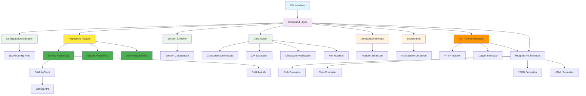

# Architecture

This document describes the architecture and design principles of AppImage Updater.

## High-Level Architecture



## Core Components

### CLI Interface (`main.py`)

The entry point for all user interactions, built with [Typer](https://typer.tiangolo.com/).

**Responsibilities:**

- Parse command-line arguments and options
- Coordinate between different components
- Handle global error handling and logging
- Orchestrate CLI command execution

**Key Features:**

- Rich console output with colors and progress bars
- Async command execution
- Structured error handling with clean user messages
- **Modular architecture** with extracted functionality:
  - `ui/display.py` - Console output formatting and display functions
  - `pattern_generator.py` - GitHub URL parsing and intelligent pattern generation
  - `config/operations.py` - Configuration management and persistence operations
  - `distribution_selector.py` - Intelligent asset selection for multi-platform releases
  - `core/system_info.py` - System detection for compatibility filtering
  - `github/auth.py` - GitHub authentication management

#### Supporting Modules

**Display Module (`ui/display.py`)**

- Console output formatting and styling
- Table generation and data presentation
- Progress indicators and status messages
- Rich console integration for enhanced UX
- Application listing and details display
- Check and download results formatting

**Pattern Generation (`pattern_generator.py`)**

- GitHub repository URL parsing and validation
- Intelligent AppImage pattern generation from actual releases
- Async GitHub API integration for pattern discovery
- Fallback pattern generation strategies
- Source type detection and URL normalization

**Configuration Operations (`config/operations.py`)**

- Application configuration loading and saving
- Configuration file and directory management
- Application addition, removal, and editing operations
- Configuration validation and error handling
- Default configuration generation
- Directory creation and validation

**Distribution Selector (`distribution_selector.py`)**

- Distribution-aware asset selection for multi-platform releases
- Automatic compatibility detection based on system information
- Interactive selection when automatic detection isn't possible
- Support for Ubuntu, Fedora, Arch, openSUSE, and other distributions
- Version compatibility scoring and selection

**System Information (`core/system_info.py`)**

- Comprehensive system detection (architecture, platform, distribution)
- Architecture compatibility checking (x86_64, arm64, i686, etc.)
- Platform detection (Linux, macOS, Windows)
- Supported format detection (.AppImage, .deb, .rpm, etc.)
- Distribution family identification for compatibility

**GitHub Authentication (`github/auth.py`)**

- GitHub token discovery from multiple sources
- Environment variable and config file token support
- GitHub CLI integration for token discovery
- Security-first priority ordering for token sources
- Authentication validation and error handling

### Configuration System

#### Configuration Models (`config/models.py`)

Pydantic-based models providing type-safe configuration validation.

**Models:**

- `GlobalConfig` - Global settings (timeouts, concurrency, logging)
- `ChecksumConfig` - Checksum verification settings
- `DefaultsConfig` - Global default settings for applications
- `ApplicationConfig` - Per-application settings

#### Configuration Loader (`config/loader.py`)

Handles loading and validation of configuration files.

**Features:**

- Single file and directory-based configuration
- Hierarchical configuration merging
- Path expansion and validation
- Error reporting with context
- Automatic configuration directory creation

### Data Models (`core/models.py`)

Core data structures used throughout the application.

**Key Models:**

- `Release` - GitHub release information
- `Asset` - Download asset with checksum association
- `UpdateCandidate` - Available update with metadata
- `CheckResult` - Update check results
- `DownloadResult` - Download operation results
- `ChecksumResult` - Checksum verification results
- `InteractiveResult` - Interactive command results
- `CommandResult` - CLI command execution results

### Repository Abstraction Layer (`repositories/`)

Extensible abstraction layer supporting multiple repository platforms with a unified interface.

**Architecture:**

- **Abstract Base Class** (`base.py`) - Common interface for all repository types
- **Factory Pattern** (`factory.py`) - Automatic client instantiation based on URL detection
- **GitHub Implementation** (`github_repository.py`) - Wrapper around existing GitHub client
- **Example Implementation** (`example_gitlab_repository.py`) - Template for adding new platforms

**Key Components:**

#### Repository Client Interface (`repositories/base.py`)

Abstract base class defining the common interface for all repository clients:

```python
class RepositoryClient(ABC):
    @abstractmethod
    async def get_latest_release(self, url: str) -> Release:
        """Get the latest release from repository."""
    
    @abstractmethod
    async def get_releases(self, url: str, limit: int = 10) -> list[Release]:
        """Get recent releases from repository."""
    
    @abstractmethod
    def parse_repo_url(self, url: str) -> tuple[str, str]:
        """Parse repository URL to extract owner and repo name."""
    
    @abstractmethod
    def normalize_repo_url(self, url: str) -> tuple[str, bool]:
        """Normalize repository URL and detect corrections."""
```

#### Repository Factory (`repositories/factory.py`)

Factory pattern implementation for automatic client creation:

```python
def get_repository_client(url: str, **kwargs) -> RepositoryClient:
    """Create appropriate repository client based on URL pattern."""
    
def detect_repository_type(url: str) -> str:
    """Detect repository type from URL (github, gitlab, etc.)."""
```

**Features:**

- **URL-based Detection** - Automatically selects appropriate client
- **Extensible Design** - Easy addition of new repository types
- **Error Handling** - Graceful fallback and error reporting
- **Configuration Support** - Repository-specific options

#### GitHub Repository Implementation (`repositories/github_repository.py`)

Wrapper around the existing GitHub client (`github/repository.py`) maintaining full compatibility:

**Features:**

- Rate limiting awareness and respect
- Automatic checksum file detection and association
- Asset filtering and pattern matching
- Error handling with exponential backoff retries
- Authentication integration with `github_auth.py`
- Release caching and efficient API usage

**Key Methods:**

- `get_releases()` - Fetch repository releases (latest or all)
- `find_checksum_assets()` - Locate and parse checksum files
- `associate_assets_with_checksums()` - Link download assets to checksums
- `filter_assets_by_pattern()` - Pattern-based asset filtering
- `get_release_by_tag()` - Fetch specific release by tag

### GitHub Integration (`github/`)

Direct GitHub API integration with comprehensive authentication and client functionality.

**Components:**

- `github/client.py` - Direct GitHub API client
- `github/auth.py` - Authentication management and token discovery
- `github/repository.py` - Repository implementation for the abstraction layer

**Note:** The GitHub client is now wrapped by `GitHubRepository` and accessed through the repository abstraction layer.

### Version Management (`core/version_checker.py`)

Handles version detection and comparison logic with intelligent fallback strategies.

**Components:**

- **Multi-Release Pattern Matching**: Searches through up to 20 releases to find assets matching specified patterns
- **Version Metadata System**: Reads version from `.info` metadata files for accurate tracking
- **Fallback Version Extraction**: Regex-based filename parsing when metadata unavailable
- **Semantic Version Parsing**: Uses `packaging.version` for proper version comparison
- **Multi-Format Support**: Works with `.zip`, `.AppImage`, and other release formats
- **Current Version Detection**: Scans local files with pattern matching

**Version Metadata Features:**

```bash
# Automatically created during downloads
Bambu_Studio_ubuntu-24.04_PR-8017.zip      # Downloaded file
Bambu_Studio_ubuntu-24.04_PR-8017.zip.info # Metadata: "Version: v02.02.01.60"
```

**Benefits:**

- Avoids incorrect parsing of OS versions ("ubuntu-24.04") as app versions
- Uses actual GitHub release tags for accurate version tracking
- Supports complex filename patterns and multi-format releases
- Automatically rotates metadata files alongside main files

### Download Engine (`core/downloader.py`)

Concurrent download manager with comprehensive features.

**Capabilities:**

- Concurrent downloads with semaphore limiting
- Progress tracking with rich progress bars
- Automatic retry with exponential backoff
- **Automatic ZIP extraction** - Extracts AppImages from ZIP archives
- **Version metadata file creation** (`.info` files with release tags)
- Checksum verification (SHA256, SHA1, MD5)
- File rotation with configurable retention (includes metadata files)
- Symlink management

**ZIP Extraction Features:**

- Automatic detection of ZIP files by extension
- Scans ZIP contents for `.AppImage` files
- Extracts AppImages from subdirectories within ZIP files
- Removes original ZIP file after successful extraction
- Handles multiple AppImages (uses first found, logs warning)
- Comprehensive error handling for invalid ZIP files
- Seamless integration with rotation and checksum systems

### Logging (`utils/logging_config.py`)

Centralized logging configuration using [Loguru](https://loguru.readthedocs.io/).

**Features:**

- Console and file logging with different levels
- Structured log formatting
- Automatic log rotation (10MB files, 7-day retention)
- Debug mode with verbose output

## Design Principles

### Async-First Architecture

All I/O operations use `asyncio` for better performance and responsiveness.

```python
async def check_updates(apps: list[ApplicationConfig]) -> list[CheckResult]:
    """Check for updates across multiple applications concurrently."""
    tasks = [check_single_app(app) for app in apps]
    return await asyncio.gather(*tasks, return_exceptions=True)
```

### Type Safety

Comprehensive type annotations with strict mypy checking.

```python
def parse_version(filename: str, patterns: list[str]) -> tuple[str | None, str]:
    """Parse version from filename using regex patterns.
    
    Returns:
        Tuple of (version, original_filename)
    """
```

### Error Handling

Structured exception hierarchy with user-friendly messages.

```python
class AppImageUpdaterError(Exception):
    """Base exception for all application errors."""

class ConfigurationError(AppImageUpdaterError):
    """Configuration validation and loading errors."""

class NetworkError(AppImageUpdaterError):
    """Network-related errors (GitHub API, downloads)."""
```

### Configuration-Driven

Flexible JSON configuration supporting multiple deployment patterns.

```json
{
  "global_config": {
    "concurrent_downloads": 3,
    "timeout": 30
  },
  "applications": [...]
}
```

## Data Flow

### Application Addition Flow


### Update Check Flow


### Configuration Loading


## Security Considerations

### Checksum Verification

All downloads support checksum verification:

- **SHA256** (recommended) - Cryptographically secure
- **SHA1** - Legacy support
- **MD5** - Legacy support (not recommended)

### Path Validation

- Path traversal prevention
- Symlink validation
- Directory creation safety
- File permission handling

### Network Security

- HTTPS-only connections
- Request timeout enforcement
- User-agent identification
- Error message sanitization

## Performance Optimizations

### Concurrent Operations

- Concurrent update checks using async I/O
- Concurrent downloads with rate limiting
- Async I/O for all network operations

#### Async Concurrency Implementation

AppImage Updater uses `asyncio.gather()` for concurrent update checking rather than the newer `asyncio.TaskGroup()` for several architectural reasons:

**Compatibility Decision:**

- `asyncio.gather()` is available since Python 3.7, ensuring broad user compatibility
- `asyncio.TaskGroup()` requires Python 3.11+, which would significantly limit adoption
- Maintaining compatibility with older Python versions is a key project goal

**Technical Rationale:**

- For I/O-bound network requests to GitHub APIs, `gather()` provides optimal simplicity and performance
- Returns results in the same order as input applications, maintaining predictable behavior
- Clean exception handling that propagates naturally without complex error management
- Minimal overhead for straightforward concurrent network operations

**Implementation:**

```python
# Concurrent execution of HTTP requests to GitHub APIs
tasks = [async_worker_func(item) for item in items]
return await asyncio.gather(*tasks)
```

**Performance Benefits:**

- **40% performance improvement** for multiple applications (48s → 29s in testing)
- **Concurrent network I/O** - Multiple HTTP requests run simultaneously
- **Ordered results** - Results match input application order automatically
- **Simple error handling** - Exceptions propagate cleanly without complex management

While `TaskGroup()` offers more structured concurrency patterns for complex scenarios, `gather()` is the optimal architectural choice for AppImage Updater's straightforward concurrent network operations.

### Caching Strategy

- GitHub API response caching (planned)
- Local version detection caching
- Pattern compilation caching

### Memory Management

- Streaming downloads for large files
- Progressive loading of configuration
- Efficient regex pattern reuse

## Package Organization

### Current Package Structure

```text
src/appimage_updater/
├── main.py                   # CLI entry point
├── pattern_generator.py      # Pattern generation and URL processing
├── distribution_selector.py  # Asset selection for multi-platform releases
│
├── config/                   # Configuration management
│   ├── models.py            # Pydantic configuration models
│   ├── loader.py            # Configuration loading and validation
│   ├── operations.py        # Configuration CRUD operations
│   ├── command.py           # Config command implementation
│   ├── cmd/                 # Config command utilities
│   └── ops/                 # Configuration operations utilities
│
├── core/                     # Core business logic
│   ├── models.py            # Core data models
│   ├── version_checker.py   # Version detection and comparison
│   ├── downloader.py        # Download engine
│   └── system_info.py       # System detection
│
├── github/                   # GitHub integration
│   ├── client.py            # GitHub API client
│   ├── auth.py              # Authentication management
│   └── repository.py        # Repository abstraction implementation
│
├── repositories/             # Repository abstraction layer
│   ├── base.py              # Abstract base class
│   ├── factory.py           # Repository client factory
│   ├── github_repository.py # GitHub implementation wrapper
│   ├── direct_download_repository.py  # Direct download handler
│   └── dynamic_download_repository.py # Dynamic download handler
│
├── services/                 # Service layer
│   └── application_service.py # Application management
│
├── ui/                       # User interface components
│   ├── display.py           # Console output and formatting
│   ├── interactive.py       # Interactive command handling
│   ├── cli_options.py       # CLI option definitions
│   ├── cli/                 # CLI utilities
│   └── display_utils/       # Display formatting utilities
│
├── utils/                    # Utility modules
│   ├── logging_config.py    # Logging configuration
│   ├── facade.py            # Facade pattern implementation
│   └── helpers/             # Helper utilities
│
├── strategies/               # Strategy pattern implementations (placeholder)
│   └── __init__.py          # Reserved for future strategy implementations
│
├── events/                   # Event system
│   ├── event_bus.py         # Event bus implementation
│   └── progress_events.py   # Progress event definitions
│
├── dist_selector/            # Distribution selection utilities
│   └── [various modules]    # Distribution-specific logic
│
```

### Architecture Principles

- **Empty `__init__.py` Files**: All `__init__.py` files contain only documentation, no code or imports
- **Direct Module Imports**: All imports use specific module paths (e.g., `from appimage_updater.core.models import Release`)
- **Clean Separation**: Each package has a clear, single responsibility
- **Modular Design**: Components can be easily tested and maintained independently

## Testing Architecture

### Test Organization

```text
tests/
├── unit/                     # Unit tests for individual components
│   ├── test_config_operations.py
│   ├── test_repositories_init.py
│   ├── test_logging_config.py
│   └── [other unit tests]
├── functional/               # Functional tests
│   ├── test_rotation.py
│   └── [other functional tests]
├── e2e/                      # End-to-end integration tests
│   ├── test_cli_commands.py
│   ├── test_add_remove_commands.py
│   └── test_pattern_matching.py
└── regression/               # Regression tests
    ├── test_add_regression.py
    └── test_defaults_regression.py
```

### Testing Strategies

- **Unit Tests** - Individual component testing
- **Integration Tests** - Component interaction testing
- **End-to-End Tests** - Complete workflow testing
- **Property-Based Tests** - Input validation testing

### Mock Strategies

- GitHub API response mocking
- File system operation mocking
- Network request mocking
- Time-based operation mocking

## Repository Factory Pattern

The repository abstraction layer uses the factory pattern to automatically select and instantiate the appropriate repository client based on URL analysis.

### Factory Implementation

```python
def get_repository_client(url: str, **kwargs) -> RepositoryClient:
    """Create appropriate repository client based on URL detection."""
    repository_types = [
        GitHubRepository,
        # Future repository types added here
    ]
    
    for repo_class in repository_types:
        temp_client = repo_class(**kwargs)
        if temp_client.detect_repository_type(url):
            return temp_client
    
    raise RepositoryError(f"No repository client available for URL: {url}")
```

### URL Detection Strategy

Each repository implementation provides URL detection logic:

- **GitHub**: Detects `github.com` and `www.github.com` domains
- **GitLab**: Would detect `gitlab.com` and self-hosted GitLab instances
- **Bitbucket**: Would detect `bitbucket.org` domains

### Benefits

- **Automatic Selection** - No manual client specification required
- **Extensible** - New repository types integrate seamlessly
- **Backward Compatible** - Existing configurations work unchanged
- **Error Handling** - Clear error messages for unsupported URLs

### Direct Download Repository Handlers

The system now supports applications that don't use traditional repository APIs through specialized handlers:

#### DirectDownloadRepository

Handles applications with static download URLs or "latest" symlinks:

- **Use Cases**: YubiKey Manager, OpenRGB with direct AppImage links
- **Detection Patterns**:
  - URLs ending with `-latest*.AppImage`
  - Direct `.AppImage` file URLs
  - Generic `/download/` endpoints
- **Version Detection**: Extracts versions from URLs using regex patterns
- **Limitations**: No historical release information, single release per check

#### DynamicDownloadRepository

Handles applications with JavaScript-generated or dynamic download pages:

- **Use Cases**: Applications with dynamic download generation
- **Detection Patterns**:
  - Dynamic download page URLs
  - Generic download pages requiring content parsing
- **Content Parsing**: Scrapes HTML for AppImage download links
- **Version Extraction**: Attempts to find version information in page content or URLs

#### Repository Handler Selection

The factory uses a priority-based selection system:

1. **GitHubRepository** - Highest priority for GitHub URLs
1. **DynamicDownloadRepository** - Checks for dynamic patterns first
1. **DirectDownloadRepository** - Fallback for direct download patterns

This ordering ensures more specific handlers are tried before generic ones.

## Extensibility

### Adding New Repository Types

The repository abstraction layer makes adding new platforms straightforward:

1. **Create Repository Implementation**

   ```python
   class GitLabRepository(RepositoryClient):
       def detect_repository_type(self, url: str) -> bool:
           return "gitlab.com" in url.lower()
       
       async def get_releases(self, url: str, limit: int = 10) -> list[Release]:
           # GitLab API implementation
   ```

1. **Register in Factory**

   ```python
   # Add to repository_types list in factory.py
   repository_types = [
       GitHubRepository,
       DynamicDownloadRepository,  # Check dynamic before direct (more specific)
       DirectDownloadRepository,
       GitLabRepository,  # New addition
   ]
   ```

1. **Add Configuration Support**

   - Update URL validation patterns
   - Add repository-specific configuration options
   - Update documentation and examples

1. **Implement Tests**

   - Unit tests for repository implementation
   - Integration tests with factory
   - End-to-end tests with real URLs

### Plugin Architecture (Planned)

Future plugin system for:

- Custom source types
- Custom download handlers
- Custom notification systems
- Custom validation rules

## Deployment Considerations

### Distribution

- PyPI package distribution
- Single executable via PyInstaller
- Docker container support
- System package formats (deb, rpm)

### Configuration Management

- XDG Base Directory Specification compliance
- Environment variable overrides
- Configuration validation and migration
- Backup and restore utilities

## HTTP Instrumentation and Dependency Injection

### HTTP Instrumentation System (`instrumentation/`)

AppImage Updater includes a sophisticated HTTP instrumentation system with dependency injection for flexible logging and monitoring of HTTP requests.

#### Architecture Overview


#### Key Components

**HTTP Logger Interface (`logging_interface.py`)**

Defines a protocol-based interface for HTTP logging with multiple implementations:

```python
class HTTPLogger(Protocol):
    def debug(self, message: str, **kwargs: Any) -> None: ...
    def info(self, message: str, **kwargs: Any) -> None: ...
    def warning(self, message: str, **kwargs: Any) -> None: ...
    def error(self, message: str, **kwargs: Any) -> None: ...
```

**Logger Implementations:**

- `LoguruHTTPLogger` - Production logging using loguru
- `ConfigurableHTTPLogger` - Customizable log levels for different message types
- `SilentHTTPLogger` - No-op logger for testing environments

**HTTP Tracker (`http_tracker.py`)**

Core instrumentation component that tracks HTTP requests using monkey patching:

- **Request Interception** - Patches `httpx.AsyncClient.request` method
- **Call Stack Capture** - Records calling context for debugging
- **Response Tracking** - Captures status codes, timing, and errors
- **Header Tracking** - Optional request header capture
- **Dependency Injection** - Accepts logger instances for flexible logging

**Factory Pattern (`factory.py`)**

Provides factory functions for easy HTTP tracker creation:

```python
def create_http_tracker_from_params(params: CheckParams) -> HTTPTracker | None:
    """Create tracker based on command parameters."""

def create_silent_http_tracker() -> HTTPTracker:
    """Create tracker with silent logging for testing."""

def create_verbose_http_tracker() -> HTTPTracker:
    """Create tracker with verbose logging for debugging."""
```

#### Dependency Injection Benefits

**Configurable Logging Levels:**

```python
# Debug-level logging (default)
tracker = create_http_tracker_from_params(params)

# Verbose logging for debugging
verbose_logger = create_default_http_logger(verbose=True)
tracker = HTTPTracker(logger=verbose_logger)

# Silent logging for testing
silent_logger = create_silent_http_logger()
tracker = HTTPTracker(logger=silent_logger)

# Custom configuration
custom_logger = ConfigurableHTTPLogger(
    LoguruHTTPLogger(),
    tracking_level="info",    # Start/stop messages
    request_level="debug",    # Individual requests
    error_level="warning"     # HTTP errors
)
```

**Command Integration:**

```python
# CLI creates tracker based on parameters
http_tracker = create_http_tracker_from_params(command.params)

# Inject into command execution
result = await command.execute(http_tracker=http_tracker)
```

#### Progressive Timeout Strategy (`core/timeout_strategy.py`)

Complementary system providing intelligent timeout handling for different HTTP operations:

- **Quick Check** (5s) - Connectivity and existence verification
- **Page Scraping** (10s) - HTML parsing for download links
- **API Requests** (15s) - GitHub API calls
- **Downloads** (300s) - File download operations
- **Fallback** (30s) - Default timeout for other operations

#### Usage Examples

**CLI Usage:**

```bash
# Enable HTTP tracking with debug logging
appimage-updater check --instrument-http --dry-run

# Verbose HTTP tracking
appimage-updater --debug check --instrument-http

# Configure tracking options
appimage-updater check --instrument-http --http-stack-depth 5 --http-track-headers
```

**Programmatic Usage:**

```python
# Create command with HTTP tracking
command = CheckCommand(params)
tracker = create_http_tracker_from_params(params)
result = await command.execute(http_tracker=tracker)

# Analyze captured requests
for request in tracker.requests:
    print(f"{request.method} {request.url} -> {request.response_status}")
```

#### Testing Integration

The dependency injection architecture enables clean testing:

```python
# Silent tracking for tests
silent_tracker = create_silent_http_tracker()
result = await command.execute(http_tracker=silent_tracker)

# Verify HTTP behavior without log noise
assert len(silent_tracker.requests) == expected_count
assert silent_tracker.requests[0].url == expected_url
```

## Monitoring and Observability

### Logging Levels

- **DEBUG** - Detailed operation tracing
- **INFO** - General operational information
- **WARNING** - Non-critical issues
- **ERROR** - Operation failures

### Metrics Collection (Planned)

- Update check frequency
- Download success rates
- Application popularity
- Error categorization

## Error Handling Architecture

### Clean Exit Strategy

AppImage Updater implements a professional error handling architecture that eliminates stack traces from user-facing output:


### Error Flow Layers

1. **Business Logic Layer** - Functions return results instead of raising exceptions

   - Configuration operations return `bool` or `None` on error
   - Interactive functions return `InteractiveResult` objects
   - Validation functions return `None` on failure

1. **Command Layer** - Coordinates business logic and returns `CommandResult`

   - Handles `None` returns from business logic
   - Converts errors to appropriate `CommandResult` objects
   - Maintains proper exit codes (1 for errors, 0 for success)

1. **CLI Layer** - Single exit point per command

   - Only place where `typer.Exit` is called
   - Clean separation between business logic and CLI concerns
   - Professional user experience with helpful error messages

1. **Exception Handler** - Final safety net

   - Catches unexpected exceptions
   - Provides clean error messages without stack traces
   - Ensures proper exit codes in all scenarios

### Error Handling Benefits

- **Professional UX** - No stack traces shown to users
- **Testable Code** - All functions return results that can be unit tested
- **Consistent Patterns** - All commands follow the same error handling approach
- **Clean Architecture** - Clear separation of concerns between layers

This architecture provides a robust, maintainable, and extensible foundation for AppImage management automation.
