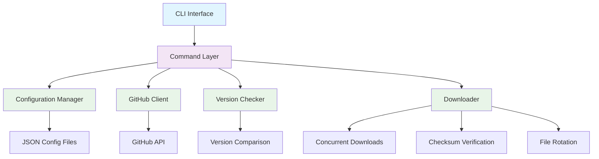

# Architecture

This document describes the architecture and design principles of AppImage Updater.

## High-Level Architecture



## Core Components

### CLI Interface (`main.py`)

The entry point for all user interactions, built with [Typer](https://typer.tiangolo.com/).

**Responsibilities:**
- Parse command-line arguments and options
- Provide user-friendly help and error messages
- Coordinate between different components
- Handle global error handling and logging

**Key Features:**
- Rich console output with colors and progress bars
- Async command execution
- Structured error handling with clean user messages

### Configuration System

#### Configuration Models (`config.py`)
Pydantic-based models providing type-safe configuration validation.

**Models:**
- `GlobalConfig` - Global settings (timeouts, concurrency, logging)
- `ChecksumConfig` - Checksum verification settings
- `FrequencyConfig` - Update frequency configuration
- `ApplicationConfig` - Per-application settings

#### Configuration Loader (`config_loader.py`)
Handles loading and validation of configuration files.

**Features:**
- Single file and directory-based configuration
- Hierarchical configuration merging
- Path expansion and validation
- Error reporting with context

### Data Models (`models.py`)

Core data structures used throughout the application.

**Key Models:**
- `Release` - GitHub release information
- `Asset` - Download asset with checksum association
- `UpdateCandidate` - Available update with metadata
- `CheckResult` - Update check results
- `DownloadResult` - Download operation results
- `ChecksumResult` - Checksum verification results

### GitHub Integration (`github_client.py`)

Async HTTP client for GitHub API interactions.

**Features:**
- Rate limiting awareness
- Automatic checksum file detection
- Asset filtering and matching
- Error handling and retries

**Key Methods:**
- `get_releases()` - Fetch repository releases
- `find_checksum_assets()` - Locate checksum files
- `associate_assets_with_checksums()` - Link files to checksums

### Version Management (`version_checker.py`)

Handles version detection and comparison logic.

**Components:**
- Version extraction from filenames using regex patterns
- Semantic version parsing with `packaging.version`
- Fallback to string comparison for non-semantic versions
- Current version detection from local files

### Download Engine (`downloader.py`)

Concurrent download manager with comprehensive features.

**Capabilities:**
- Concurrent downloads with semaphore limiting
- Progress tracking with rich progress bars
- Automatic retry with exponential backoff
- Checksum verification (SHA256, SHA1, MD5)
- File rotation with configurable retention
- Symlink management

### Logging (`logging_config.py`)

Centralized logging configuration using [Loguru](https://loguru.readthedocs.io/).

**Features:**
- Console and file logging with different levels
- Structured log formatting
- Automatic log rotation (10MB files, 7-day retention)
- Debug mode with verbose output

## Design Principles

### Async-First Architecture

All I/O operations use `asyncio` for better performance and responsiveness.

```python
async def check_updates(apps: list[ApplicationConfig]) -> list[CheckResult]:
    """Check for updates across multiple applications concurrently."""
    tasks = [check_single_app(app) for app in apps]
    return await asyncio.gather(*tasks, return_exceptions=True)
```

### Type Safety

Comprehensive type annotations with strict mypy checking.

```python
def parse_version(filename: str, patterns: list[str]) -> tuple[str | None, str]:
    """Parse version from filename using regex patterns.
    
    Returns:
        Tuple of (version, original_filename)
    """
```

### Error Handling

Structured exception hierarchy with user-friendly messages.

```python
class AppImageUpdaterError(Exception):
    """Base exception for all application errors."""

class ConfigurationError(AppImageUpdaterError):
    """Configuration validation and loading errors."""

class NetworkError(AppImageUpdaterError):
    """Network-related errors (GitHub API, downloads)."""
```

### Configuration-Driven

Flexible JSON configuration supporting multiple deployment patterns.

```json
{
  "global_config": {
    "concurrent_downloads": 3,
    "timeout": 30
  },
  "applications": [...]
}
```

## Data Flow

### Application Addition Flow


### Update Check Flow


### Configuration Loading


## Security Considerations

### Checksum Verification

All downloads support checksum verification:

- **SHA256** (recommended) - Cryptographically secure
- **SHA1** - Legacy support
- **MD5** - Legacy support (not recommended)

### Path Validation

- Path traversal prevention
- Symlink validation
- Directory creation safety
- File permission handling

### Network Security

- HTTPS-only connections
- Request timeout enforcement
- User-agent identification
- Error message sanitization

## Performance Optimizations

### Concurrent Operations

- Parallel update checks across applications
- Concurrent downloads with rate limiting
- Async I/O for all network operations

### Caching Strategy

- GitHub API response caching (planned)
- Local version detection caching
- Pattern compilation caching

### Memory Management

- Streaming downloads for large files
- Progressive loading of configuration
- Efficient regex pattern reuse

## Testing Architecture

### Test Organization

```
tests/
├── test_e2e.py              # End-to-end integration tests
├── test_edit_command.py     # CLI command testing
├── test_edit_validation_fixes.py  # Validation testing
└── test_rotation.py         # File rotation testing
```

### Testing Strategies

- **Unit Tests** - Individual component testing
- **Integration Tests** - Component interaction testing
- **End-to-End Tests** - Complete workflow testing
- **Property-Based Tests** - Input validation testing

### Mock Strategies

- GitHub API response mocking
- File system operation mocking
- Network request mocking
- Time-based operation mocking

## Extensibility

### Adding New Source Types

1. Define new source type in `models.py`
2. Implement client class (e.g., `GitLabClient`)
3. Add configuration validation
4. Implement release fetching logic
5. Add comprehensive tests

### Plugin Architecture (Planned)

Future plugin system for:
- Custom source types
- Custom download handlers
- Custom notification systems
- Custom validation rules

## Deployment Considerations

### Distribution

- PyPI package distribution
- Single executable via PyInstaller
- Docker container support
- System package formats (deb, rpm)

### Configuration Management

- XDG Base Directory Specification compliance
- Environment variable overrides
- Configuration validation and migration
- Backup and restore utilities

## Monitoring and Observability

### Logging Levels

- **DEBUG** - Detailed operation tracing
- **INFO** - General operational information
- **WARNING** - Non-critical issues
- **ERROR** - Operation failures

### Metrics Collection (Planned)

- Update check frequency
- Download success rates
- Application popularity
- Error categorization

This architecture provides a robust, maintainable, and extensible foundation for AppImage management automation.
