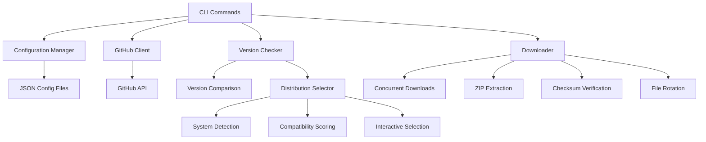

# AppImage Updater

A professional, enterprise-ready Linux service for automating the finding and downloading of AppImage applications from their respective websites.

AppImage Updater is a modern, type-safe Linux CLI application built with a layered architecture that monitors configured applications (like FreeCAD, OrcaSlicer, etc.) for new releases and provides automated downloading of updated AppImage files from GitHub releases and other sources.

**Platform Support**: Linux only - AppImage is a Linux-specific package format.

## Features

### Core Functionality

- **Automated Updates** - Monitor GitHub repositories for new releases
- **Distribution-Aware Selection** - Intelligent selection of best compatible distribution package
- **Smart Pattern Matching** - Flexible regex patterns to identify correct AppImage files
- **Intelligent Pattern Generation** - Smart regex creation from actual GitHub releases
- **ZIP Archive Support** - Automatic extraction of AppImages from ZIP files
- **Prerelease Detection** - Automatic detection of continuous build repositories
- **Multi-Distribution Support** - Handle Ubuntu, Fedora, Debian, Arch, and other distributions

### Security & Reliability

- **Checksum Verification** - SHA256, SHA1, and MD5 checksum validation for security
- **GitHub Authentication** - Token support for increased API rate limits
- **Retry Logic** - Exponential backoff for robust error handling
- **Type Safety** - 100% mypy compliance for runtime reliability

### Performance & Usability

- **High Performance** - Async operations with concurrent downloads and parallel processing
- **Multi-Format Output** - Rich terminal UI, plain text, JSON, and HTML output formats
- **File Rotation** - Keep multiple versions with automatic cleanup (fixed naming)
- **Symlink Management** - Stable paths for applications through symbolic links
- **Interactive Selection** - User-friendly menus for uncommon distributions
- **Flexible Configuration** - JSON-based configuration with global and per-app settings

### Quality & Architecture

- **Professional Architecture** - Layered design with clear separation of concerns
- **Perfect Complexity Management** - A-grade complexity rating (zero B+ functions)
- **Zero Dead Code** - Comprehensive cleanup with smart filtering
- **Comprehensive Testing** - 456 tests with 63% coverage and 100% success rate
- **Enterprise Ready** - Robust error handling and professional code standards

## Requirements

- **Python 3.11+** - Required for modern async/await and type features
- **Linux** - Only supported platform (AppImage is Linux-specific)
- **Internet Connection** - For GitHub API access and downloads

## Quick Start

1. **Install** the application (see [Installation Guide](installation.md) for all methods):

   ```bash
   pipx install appimage-updater
   ```

1. **Add** an application (configuration is created automatically):

   ```bash
   appimage-updater add FreeCAD https://github.com/FreeCAD/FreeCAD ~/Applications/FreeCAD
   ```

1. **Check** for updates:

   ```bash
   appimage-updater check
   ```

For complete command documentation and advanced usage, see the [Usage Guide](usage.md).

## Architecture Overview



## Key Components

- **Configuration System** - Flexible JSON-based configuration supporting both single files and directory structures
- **GitHub Integration** - Robust GitHub API client with rate limiting and error handling
- **Distribution Selector** - Intelligent selection of compatible distribution packages with interactive fallback
- **Version Management** - Sophisticated version detection and comparison using semantic versioning
- **Download Engine** - Concurrent downloads with automatic ZIP extraction, progress tracking, and checksum verification
- **File Management** - Optional file rotation with configurable retention policies and symlink management

## Documentation

### User Guides

- **[Installation](installation.md)** - Complete installation methods and troubleshooting
- **[Getting Started](getting-started.md)** - Step-by-step tutorial and basic usage
- **[Usage Guide](usage.md)** - Complete CLI command reference
- **[Examples](examples.md)** - Practical usage patterns and workflows
- **[Configuration](configuration.md)** - Advanced configuration options

### Feature Guides

- **[ZIP Support](zip-support.md)** - Handling applications distributed in ZIP files
- **[Rotation Guide](rotation.md)** - File rotation and symlink management
- **[Compatibility](compatibility.md)** - Distribution compatibility and selection

### Support & Maintenance

- **[Security Guide](security.md)** - Authentication, checksums, and security best practices
- **[Troubleshooting](troubleshooting.md)** - Common issues, solutions, and diagnostics
- **[Changelog](changelog.md)** - Version history and release notes

### Developer Resources

- **[Architecture](architecture.md)** - System design and component overview
- **[Developer Commands](commands.md)** - Task automation and development tools
- **[Development](development.md)** - Setting up development environment
- **[Testing](testing.md)** - Running tests and quality checks
- **[Contributing](contributing.md)** - Guidelines for contributing to the project

## Getting Started

Ready to automate your AppImage updates? Head over to the [Installation](installation.md) guide to get started, or check out the [Getting Started](getting-started.md) tutorial for a walkthrough of the basic features.
