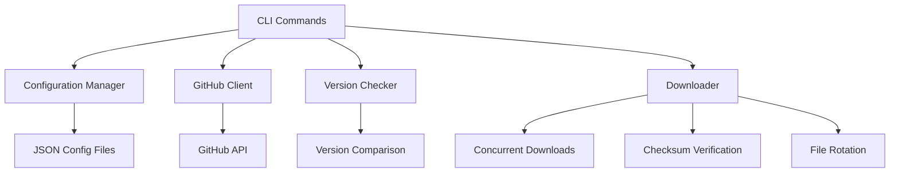

# AppImage Updater

A service for automating the finding and downloading of AppImage applications from their respective websites.

AppImage Updater monitors configured applications (like FreeCAD, OrcaSlicer, etc.) for new releases and provides an automated way to download updated AppImage files from GitHub releases and other sources.

## Features

- **Automated Updates** - Monitor GitHub repositories for new releases
- **Smart Pattern Matching** - Flexible regex patterns to identify correct AppImage files
- **Checksum Verification** - SHA256, SHA1, and MD5 checksum validation for security
- **File Rotation** - Keep multiple versions with automatic cleanup
- **Symlink Management** - Stable paths for applications through symbolic links  
- **Concurrent Downloads** - Fast, parallel downloading with progress tracking
- **Rich CLI** - Beautiful terminal interface with colors and progress bars
- **Flexible Configuration** - JSON-based configuration with global and per-app settings

## Quick Start

1. **Install** the application:
   ```bash
   pip install appimage-updater
   ```

2. **Initialize** configuration:
   ```bash
   appimage-updater init
   ```

3. **Add** an application:
   ```bash
   appimage-updater add FreeCAD https://github.com/FreeCAD/FreeCAD ~/Applications/FreeCAD
   ```

4. **Check** for updates:
   ```bash
   appimage-updater check
   ```

## Architecture Overview



## Key Components

- **Configuration System** - Flexible JSON-based configuration supporting both single files and directory structures
- **GitHub Integration** - Robust GitHub API client with rate limiting and error handling
- **Version Management** - Sophisticated version detection and comparison using semantic versioning
- **Download Engine** - Concurrent, resumable downloads with progress tracking and checksum verification
- **File Management** - Optional file rotation with configurable retention policies

## Getting Started

Ready to automate your AppImage updates? Head over to the [Installation](installation.md) guide to get started, or check out the [Getting Started](getting-started.md) tutorial for a walkthrough of the basic features.

For developers interested in contributing or understanding the codebase, see the [Architecture](architecture.md) and [API Reference](reference/appimage_updater/index.md) documentation.
