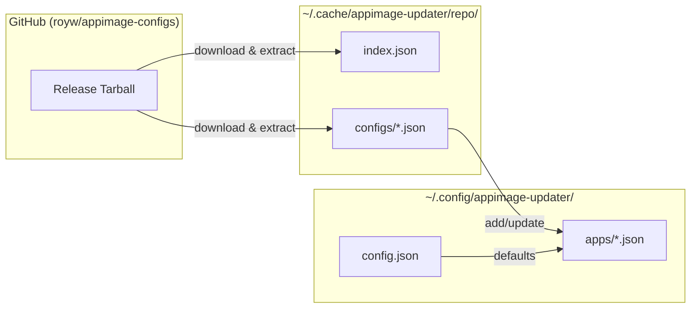
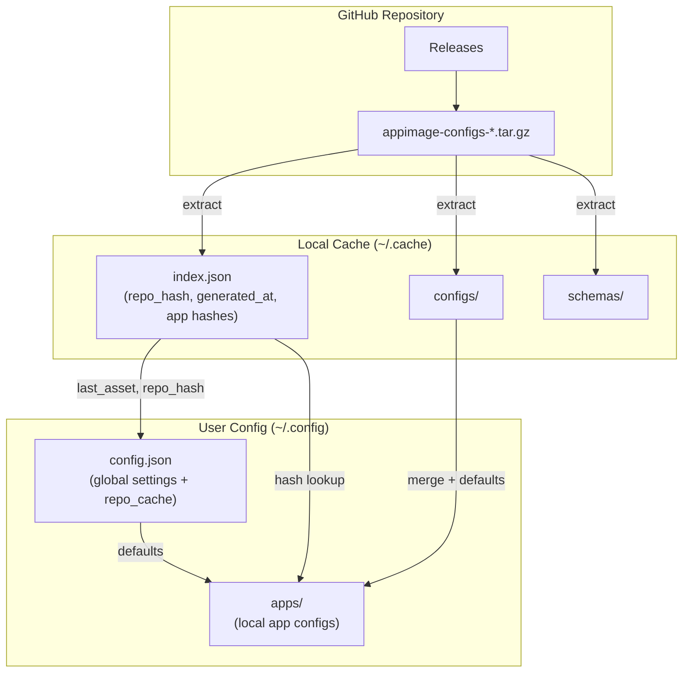
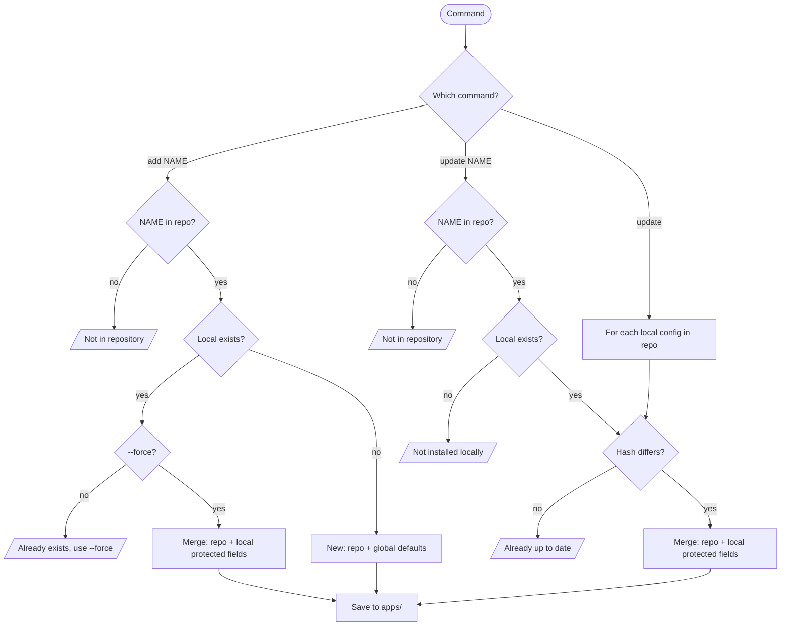

# Package Repository Feature Plan

This document outlines the plan for adding centralized app configuration repository support, transforming appimage-updater into a full package manager.

## Overview

Users will be able to install pre-configured applications by name from a central repository of app configuration files, rather than manually configuring each application.

**Note:** The repository stores only metadata (`{name}.json` config files), not the actual AppImage files. AppImages are still downloaded directly from their upstream sources (GitHub, GitLab, SourceForge, etc.).

### Architecture Diagrams

#### Data Flow



#### Cache Architecture



#### Command Workflow



______________________________________________________________________

## Phase 1: Global Configuration

### Config Schema Updates

- [ ] Add `app_repo_url` field to `GlobalConfig` in `config/models.py`
- [ ] Default value: `https://github.com/royw/appimage-configs`
- [ ] Add validation for repo URL format

### Config Commands

- [ ] `appimage-updater config set app-repo-url {URL}` - Set custom repo URL
- [ ] `appimage-updater config get app-repo-url` - Display current repo URL
- [ ] Update config command help text and documentation

______________________________________________________________________

## Phase 2: Repository Client

### New Module: `repositories/app_configs/`

- [ ] Create `client.py` - GitHub raw content fetcher
- [ ] Create `models.py` - Data models for remote config metadata
- [ ] Create `exceptions.py` - Custom exceptions (ConfigNotFound, RepoUnavailable)

### Client Features

- [ ] `check_for_updates() -> bool` - Check GitHub API for newer release
- [ ] `download_release() -> Path` - Download latest release tarball
- [ ] `get_index() -> dict` - Return index.json from local cache
- [ ] `list_available() -> list[str]` - List app names from cached index
- [ ] `config_exists(name: str) -> bool` - Check if name exists in index
- [ ] `get_config(name: str) -> dict` - Get config from local cache, verify hash
- [ ] Handle GitHub rate limiting (use token if available)

### Release Discovery

- [ ] Use GitHub API: `GET /repos/{owner}/{repo}/releases/latest`
- [ ] Compare `tag_name` or asset filename with cached version
- [ ] Download tarball asset when update available

### Repository Structure (Remote)

- [ ] Document expected repo structure: `configs/{name}.json`
- [x] Define config JSON schema requirements (`schemas/app-config.schema.json`) ✓
- [x] Configs must use relative paths (enforced by schema and validate_configs.py) ✓
- [ ] Create template/example config file

### Index File (`index.json`)

- [x] Create `index.json` at repo root with structure: ✓

  ```json
  {
    "repo_hash": "sha256:...",
    "generated_at": "2025-12-06T00:00:00Z",
    "OrcaSlicer": ["configs/OrcaSlicer.json", "sha256:abc123..."],
    "FreeCAD": ["configs/FreeCAD.json", "sha256:def456..."],
    ...
  }
  ```

- [x] Script to regenerate index.json (`scripts/update_index.py`) ✓
  - Generates `repo_hash` from all config hashes (for quick change detection)
  - Includes `generated_at` timestamp

- [x] GitHub Action to build and release (`.github/workflows/update-index.yml`) ✓

### Release Distribution

- [x] GitHub Action creates timestamped release on config changes ✓
- [x] Tarball asset: `appimage-configs-YYYYMMDD-HHMMSS.tar.gz` ✓
- [x] Contains: `index.json`, `configs/`, `schemas/` ✓
- [ ] Client fetches latest release asset
- [ ] Extract and cache locally

### Local Cache Structure

**Cache location:** `~/.cache/appimage-updater/repo/`

```text
~/.cache/appimage-updater/repo/
├── index.json          # Extracted from tarball (contains repo_hash, generated_at)
├── configs/            # Extracted config files
│   ├── OrcaSlicer.json
│   ├── FreeCAD.json
│   └── ...
└── schemas/            # Extracted schemas
    └── app-config.schema.json
```

**Cache metadata in `config.json`** (`repo_cache` section):

```json
{
  "global_config": { ... },
  "repo_cache": {
    "last_asset": "appimage-configs-20251206-020000.tar.gz",
    "last_checked": "2025-12-06T00:00:00Z",
    "repo_hash": "sha256:..."
  }
}
```

### Cache Operations

- [ ] On `update --check`: fetch latest release metadata from GitHub API
  - Compare asset name vs cached `last_asset` in `config.json`
  - If same → "No updates available"
  - If different → download new tarball, extract, update `repo_cache`
- [ ] Update `repo_cache` in `config.json` after successful download
- [ ] `--force` flag to bypass cache and force re-download
- [ ] Verify downloaded config hash matches index

______________________________________________________________________

## Phase 3: Config Path Resolution

### Relative Path Design (Already Implemented)

App configs use **relative paths** that resolve against global config:

- Config: `"download_dir": "FreeCAD"`
- Global: `download_dir: "/home/user/AppImages"`
- Result: `/home/user/AppImages/FreeCAD`

Configs are required to be portable (enforced when testing PR with `appimage-configs/scripts/validate_configs.py` and by `appimage-configs/scripts/update_index.py` when github action creates `index.json`).

### Path Resolution Prerequisites

Commands that install configs from repo require base paths to be set:

**Option 1: Global config** (recommended)

```bash
appimage-updater config set download-dir /home/user/AppImages
appimage-updater config set symlink-dir /home/user/bin
```

**Option 2: CLI options** (per-command override)

```bash
appimage-updater add OrcaSlicer --download-dir /path/to/appimages --symlink-dir /path/to/bin
```

**Validation:**

- [ ] Before fetching repo config, verify base paths are resolvable

- [ ] If global config paths not set and CLI options not provided, show helpful error:

  ```text
  Error: Cannot install from repository - no base paths configured.

  Set global paths:
    appimage-updater config set download-dir /path/to/appimages
    appimage-updater config set symlink-dir /path/to/bin

  Or provide CLI options:
    appimage-updater add OrcaSlicer --download-dir /path --symlink-dir /path
  ```

- [ ] Verify resolved paths exist (or offer to create them)

### Local Config Management

Configs fetched from the remote repo are stored locally in the same `apps/` directory
as manually-created configs. This means:

- **No separate storage** - repo configs and manual configs live in the same place
- **Same format** - repo configs become regular local configs once saved

**Storage location:**

- Default: `~/.config/appimage-updater/apps/{name}.json`
- Overridable via `--config-dir` CLI option

**On initial `add` from repo** (no existing local config):

- Repo fields: `name`, `url`, `pattern`, `download_dir`, `prerelease`, etc.
- Set to `true`: `enabled`
- From global defaults: `rotation_enabled`, `retain_count`
- Derived from global defaults: `symlink_path` (using `symlink_enabled`, `symlink_dir`, `symlink_pattern`, `auto_subdir`)

**On `update` from repo** (existing local config):

- Updated from repo: `name`, `url`, `pattern`, `download_dir`, `prerelease`, etc.
- Preserved locally: `enabled`, `rotation_enabled`, `retain_count`, `symlink_path`

**Comparison with repo:**

No repo-source tracking needed. Commands compare local config hash vs `index.json` hash:

- Local hash computed on-the-fly from `apps/{name}.json` content
- Repo hash from `index.json[name][1]`
- Different hash → config has changed (either direction)

**Command behavior:**

- `update {NAME}` - If NAME exists in repo AND local hash differs, update from repo
- `update` (no args) - Update ALL local configs that exist in repo with different hash
- `diff {NAME}` - If NAME exists in both local and repo, show differences
- `list --changed` - List local configs where hash differs from repo version

______________________________________________________________________

## Phase 4: Command Implementation

### `add` Command Changes

- [ ] `appimage-updater add {NAME}` - Fetch from repo by name
- [ ] Lookup `{NAME}.json` in configured repo
- [ ] If not found: display "App '{NAME}' not available in repository"
- [ ] If found: download and save to local apps directory
- [ ] Apply path variable substitution during save
- [ ] Display success message with app details
- [ ] Preserve existing `add {NAME} {URL}` behavior for manual configs
  - URL provided → manual config (existing behavior)
  - No URL → look up in repo (new behavior)

### `update` Command (New)

- [ ] `appimage-updater update {NAME}` - Update single app config from repo
- [ ] `appimage-updater update` - Update all local configs that exist in repo
- [ ] `--config-dir` option - Override config directory
- [ ] `--dry-run` flag - Show what would change without modifying
- [ ] `--check` flag - Check for updates without applying
  - Lists configs with available updates
  - Exit code 0 if updates available, 1 if up-to-date (for scripting)
- [ ] Skip local configs not in repo (manual configs)
- [ ] If NAME not in repo: display "App '{NAME}' not available in repository"
- [ ] Show summary: updated, skipped (not in repo), skipped (unchanged), failed

### `diff` Command (New)

- [ ] `appimage-updater diff {NAME}` - Compare local vs repo config
- [ ] `--config-dir` option - Override config directory
- [ ] If NAME not in repo: display "App '{NAME}' not available in repository"
- [ ] If NAME not local: display "App '{NAME}' not installed locally"
- [ ] `--format` option - Output format (rich|plain|json|html|markdown)
- [ ] Extend formatters with `print_diff()` method:
  - rich/plain/html/markdown: unified diff output (similar to git diff)
  - json: structured diff data

### `list` Command Changes

- [ ] `appimage-updater list` - List locally installed apps (existing behavior)
- [ ] `appimage-updater list --available` - List apps available in repo
- [ ] `appimage-updater list --all` - Show both local and available
- [ ] `appimage-updater list --changed` - List local configs with updates available in repo
- [ ] `appimage-updater list --new` - List repo configs not yet installed locally
- [ ] Indicate which available apps are already installed
- [ ] Add column for source (local/repo) in list output

______________________________________________________________________

## Phase 5: Error Handling

### Network Errors

- [ ] Handle repo unreachable gracefully
- [ ] Provide helpful error messages with troubleshooting hints
- [ ] Allow offline operation for already-installed apps

### Config Conflicts

- [ ] Detect when local config differs from repo version
- [ ] `add` command: warn if app already exists, require `--force` to overwrite
- [ ] `update` command: show diff before applying changes (unless `--yes`)

### Validation

- [ ] Validate fetched configs against schema before saving
- [ ] Check for required fields (name, url, pattern, etc.)
- [ ] Warn about deprecated or unknown fields

______________________________________________________________________

## Phase 6: Documentation

### User Documentation

- [ ] Update `docs/getting-started.md` with repository usage
- [ ] Create `docs/app-repository.md` explaining the feature
- [ ] Add examples for common workflows
- [ ] Document how to use custom/private repositories

### Repository Maintainer Documentation

- [ ] Create `CONTRIBUTING.md` for the configs repository
- [ ] Document config JSON schema
- [ ] Provide validation script for contributors
- [ ] Set up CI for the configs repository

### CLI Help

- [ ] Update `--help` text for modified commands
- [ ] Add examples in help output

______________________________________________________________________

## Phase 7: Testing

### Unit Tests

- [ ] Test config fetching with mocked responses
- [ ] Test path variable substitution
- [ ] Test error handling (not found, network errors)
- [ ] Test list filtering (available, installed, all)

### Integration Tests

- [ ] Test full add workflow from repo
- [ ] Test update workflow
- [ ] Test diff output formatting

### Functional Tests

- [ ] Test with real repository (dry-run mode)
- [ ] Test offline behavior

______________________________________________________________________

## Phase 8: Initial App Configs Repository

### Repository Setup

- [x] Create `royw/appimage-configs` repository ✓
- [x] Populate with initial configs from `~/.config/appimage-updater/apps/*.json` ✓
- [x] Add README with usage instructions ✓
- [x] GitHub Action validates configs (done in `update-index.yml`) ✓

### Initial Configs

- [x] Migrate existing working configs ✓
- [x] Configs use relative paths (already portable) ✓
- [x] Validate all configs work with current appimage-updater (`recreate.sh`) ✓

______________________________________________________________________

## Future Enhancements (Out of Scope)

- [ ] Multiple repository support (priority ordering)
- [ ] Private repository authentication
- [ ] Config versioning/rollback
- [ ] Community contribution workflow
- [ ] Automatic config updates on `check` command
- [ ] Config categories/tags for discovery

______________________________________________________________________

## Implementation Order

1. **Phase 1**: Global config changes (foundation)
1. **Phase 2**: Repository client (core functionality)
1. **Phase 3**: Path resolution (required for usable configs)
1. **Phase 4**: Commands (user-facing features)
1. **Phase 5**: Error handling (robustness)
1. **Phase 6**: Documentation (user adoption)
1. **Phase 7**: Testing (quality assurance)
1. **Phase 8**: Configs repository (content)

______________________________________________________________________

## Design Decisions (Resolved)

1. **Conflict resolution**: Merge with protected fields (see below)
2. **Metadata tracking**: None needed - compare local hash (computed on-the-fly) vs `index.json` hash
3. **Path variables**: Not needed - configs use relative paths resolved against global config paths
4. **Offline mode**: Cached - tarball extracted locally, works offline until next update
5. **Authentication**: Deferred - private repos listed in Future Enhancements
6. **Branch field**: Not needed - releases are discovered via GitHub API `/releases/latest`

### Conflict Resolution Details

When updating an existing config from repo, **preserve these local fields**:

- `enabled` - user's enabled/disabled state
- `rotation_enabled` - user's rotation preference
- `retain_count` - user's retention count
- `symlink_path` - user's symlink location

All other fields (name, url, pattern, download_dir, prerelease, etc.) come from repo.

**On initial `add` from repo** (no existing local config):

- `rotation_enabled`, `retain_count` → from global `config.json` defaults
- `symlink_path` → derived from global defaults (`symlink_enabled`, `symlink_dir`, `symlink_pattern`, `auto_subdir`) using same logic as existing `add` command
